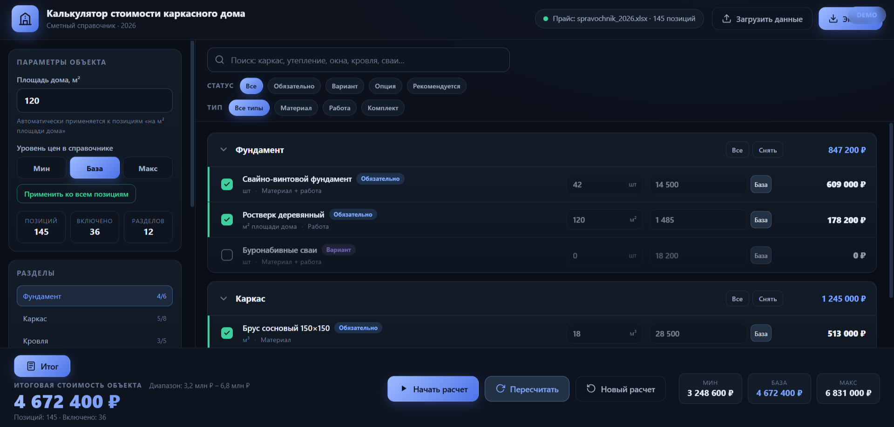

<div align="center">

# Калькулятор стоимости каркасного дома

**Десктоп-приложение для автоматического расчёта сметы строительства каркасного дома**



</div>

---

## Решаемая задача

Строительство каркасного дома — это десятки позиций в смете: фундамент, каркас, кровля, утепление, отделка, инженерия. Каждая позиция имеет три уровня цены (Минимальная / Базовая / Максимальная), и итоговая стоимость может варьироваться в разы.

**Калькулятор решает:**
- Быстро строить смету из справочника позиций
- Менять цены, объёмы и состав работ в реальном времени
- Видеть диапазон стоимости (Мин – Макс) по каждой позиции и всей смете
- Сверяться с контрольными бюджетами (Эконом / Комфорт / Премиум)
- Экспортировать готовую смету в Excel для передачи клиенту

## Пользователь

- **Строительные компании и подрядчики** — для формирования смет клиентам
- **Бригадиры и прорабы** — для планирования бюджета строительства
- **Заказчики (владельцы участков)** — для понимания ориентировочной стоимости дома

## Стек технологий

| Компонент | Технология |
|---|---|
| Язык | Python 3 |
| Десктоп-оболочка | pywebview (WebView2) |
| Интерфейс | HTML / CSS / JS |
| Работа с Excel | openpyxl |
| Сборка .exe | PyInstaller |
| Установщик | Inno Setup 6 |

## Как запустить

### Из исходников (для разработки)

```bash
# 1. Клонируйте репозиторий
git clone https://github.com/ElanaBit/CalculatorKarkasnogoDoma.git
cd CalculatorKarkasnogoDoma

# 2. Установите зависимости
pip install pywebview openpyxl

# 3. Запустите приложение
python app\main.py
```

Для отладки в браузере:
```bash
python app\main.py --browser
```

### Портативная версия (без установки)

Скачайте папку `release\КалькуляторКаркасногоДома\` и запустите `КалькуляторКаркасногоДома.exe`.

> Требование: Microsoft Edge WebView2 Runtime (обычно уже встроен в Windows 10/11).

### Сборка .exe

```bash
pyinstaller app.spec --noconfirm
```

## Как пользоваться

1. Откройте приложение
2. Нажмите **«Загрузить данные»** и выберите Excel-файл прайса
3. Задайте **площадь дома** в левой панели
4. Нажмите **«Начать расчет»** — обязательные позиции включены автоматически
5. Настраивайте смету: включайте/выключайте позиции, меняйте цены и количество
6. Нажмите **«Экспорт»** — смета сохранится в Excel

## Формат прайс-листа

Приложение загружает Excel-файл со следующими колонками:

| Колонка | Заголовок |
|---|---|
| Раздел | `Раздел` |
| Подраздел | `Подраздел` |
| Наименование | `Наименование позиции` |
| Тип | `Тип позиции` (Материал / Работа / …) |
| Единица | `Единица измерения` |
| Мин. цена | `Минимальная цена, ₽` |
| Баз. цена | `Базовая цена, ₽` |
| Макс. цена | `Максимальная цена, ₽` |
| Статус | `Статус` (Обязательно / Вариант / Опция / …) |

Эталонный формат: `New_spravochnik_stoimosti_karkasnogo_doma_2026…xlsx`

## Структура проекта

```
app/
  main.py               — точка входа, окно pywebview
  api.py                — JS-API: данные, загрузка прайса, экспорт
  price_parser.py       — разбор прайс-таблицы xlsx
  estimate_export.py    — формирование Excel-сметы
  app.ico               — иконка приложения
  web/                  — интерфейс (HTML/CSS/JS)
app.spec                — конфиг PyInstaller
installer.iss           — скрипт Inno Setup
build.bat               — полная сборка
```
